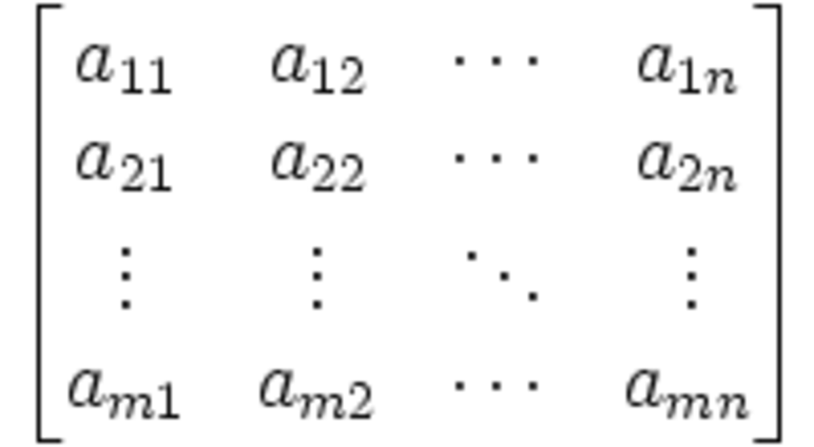
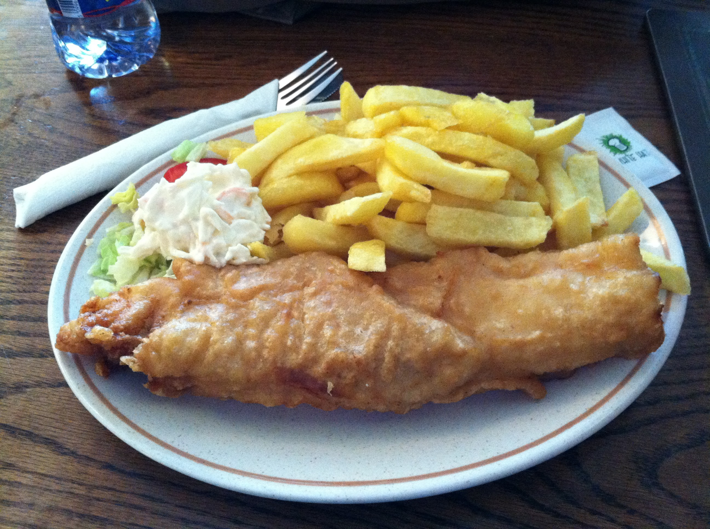
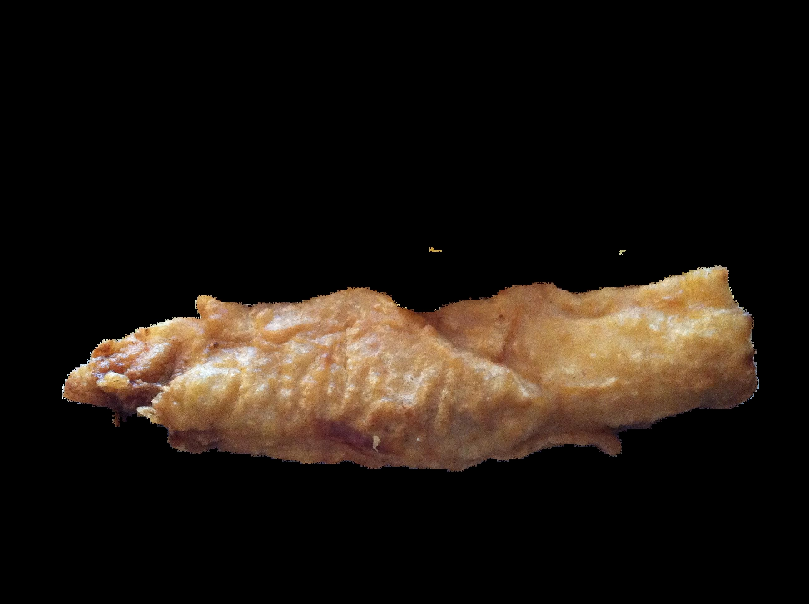

# DietVision

TODO: Oneliner definition of DietVision

## Human vs Machine

What human sees             |  What machine sees
:-------------------------:|:-------------------------:
  |  

## Behind the Scene

1. Segment objects in image
2. Classifiy objects
3. Then calculate food's nutritional data

## Image Segmentation

### Segment Anything Model

Meta AI has released the Segment Anything Model (SAM), a new open source AI model that can segment any object in an image or video with a single click.
The image 

Original image             |  Segmented image
:-------------------------:|:-------------------------:
  |  

### Mask

A mask is a binary image consisting of zero and non-zero values.
Typically, each pixel is assigned a number between 0 and 255, where 0 represents the complete absence of light (black) and 255 represents complete saturation of light (white).

The image on the left is the mask of the table. The other image shows table without masking and applying grayscale color.

Mask             |  Mask (Filled with original colors)
:-------------------------:|:-------------------------:
  |  

## Image Classification

### Contrastive Language-Image Pre-Training (CLIP)

OpenAI has released the Contrastive Language-Image Pre-Training (CLIP) that is an open source, multi-modal, zero-shot model. Given an image and text descriptions, the model can predict the most relevant text description for that image, without optimizing for a particular task.

### Integration with DietVision

CLIP is trained with the Food 101 model. It processes the given image and returns an array with 101 elements. Each element of an array represents a likelihood that an object is identified as corresponding food class. Then it returns a class with the highest `P-Value`

| #   | Class          | P-Value |
|-----|----------------|---------|
| 1   | apple_pie      | 0.044355|
| 2   | baby_back_ribs | 0.1569811|
|     | ...            |   ...   |
| n   | fried_chicken  | 0.868926|
|     | ...            |   ...   |
| 101 | waffles        | 0.0410287 |

## Demo

