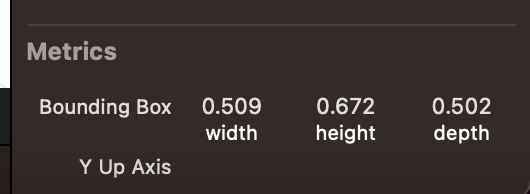
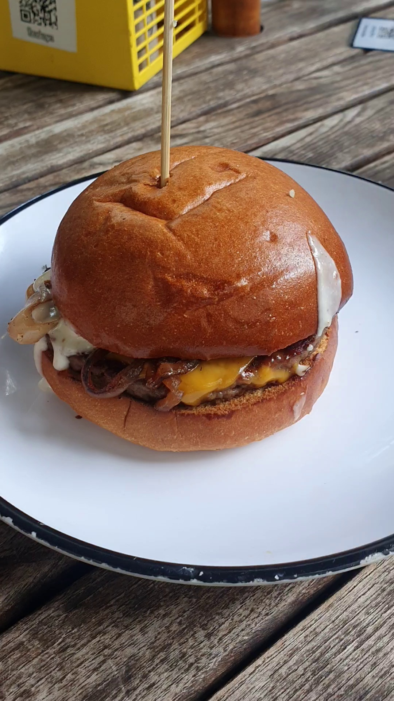
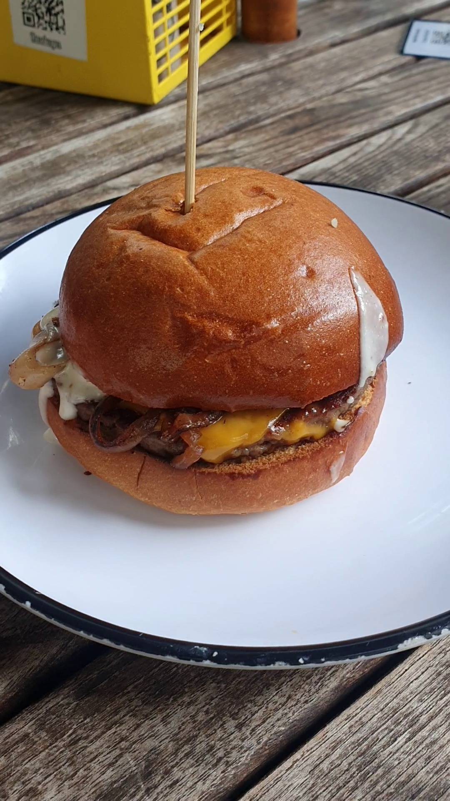
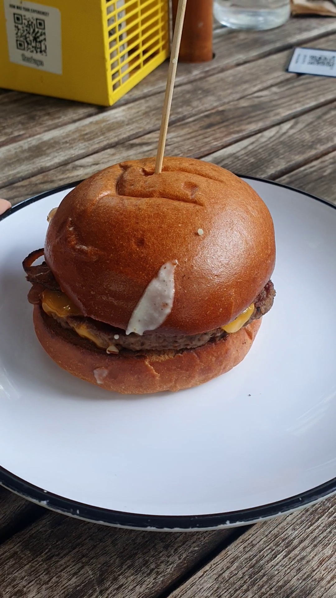

# HelloPhotogrammetry

`HelloPhotogrammetry` is a Apple's Photogrammetry based program that generates 3D object. 
It produces `USDZ` file which contains metadata of your 3D object.

## Prerequisite

- MacOS
- XCode

## Download

https://drive.google.com/drive/folders/1QrL0Vhvw5GvIQ8fbHfb9EOsnOlPMmXLG?usp=share_link

Please submit an access request. Account holder will approve your request.

- Source code of `HelloPhotogrammetry`
- Executable file named `HelloPhotogrammetry`
- Sample Image set

## Run

```shell
./HelloPhotogrammetry <path_to_image_set_directory> <path_to_usdz_destination>/<name of usdz file>.usdz
```

## Things you should know about the program

- Size of image set: The more you have the better outcome gets. In other words, the less you have the less accurate outcome gets.
- Run time: Usually, it takes at least 5 minutes. This is considerably an import factor when you integrate the program into DietVision. 
- Metadata from `USDZ`: See attached image below

Metrics in `USDZ`             
:-------------------------:
  
*Fig.1.1* 

- Image order: Each image must be continuous.

Good case. Outcome is as expected.

`Frame 1`             |  `Frame 2`              
:-------------------------:|:--------------------------:
  |   
*Fig.2.1*                  | *Fig.2.2*                  

Bad case. Outcome is not as expected.
`Frame 1`             |  `Frame 100`
:-------------------------:|:--------------------------:
  |   
*Fig.3.1*                  | *Fig.3.2*                  

## Volume Calculation

### Prerequisite 

- `usd-core` Python package ([link](https://pypi.org/project/usd-core/))

### Code

This is a snippet and not optimized. Please google `usd-core` to learn more about the package.

```python
from pxr import Usd
stage = Usd.Stage.Open(f'{HOME}/Burger.usdz') # Assume that I created Burger.usdz using HelloPhotogrammetry

for prim_ref in stage.Traverse():
  path = prim_ref.GetPath()
  if path == '/baked_mesh/Geom/g0': # See attached image below
    for prop in prim_ref.GetPropertyNames():
      if prop == 'extent':
        try:
          print(f'{path} / {prop} / {prim_ref.GetProperty(prop).Get()}')
        except:
          pass
```

This is the output of the `prim_ref.GetProperty(prop).Get()`. You get an array of two triples. 

```python
[(-0.27488237619400024, -0.2523643374443054, -0.2305058389902115), # (width, height, depth)
(0.23457875847816467, 0.41973328590393066, 0.2716067433357239)]    # (width, height, depth)
```

In *Fig.1.1*, you get (width, height, depth) = (0.509, 0.672, 0.502). The way you can compute the values obtained in the `USDZ` is as below:

- 0.509 = abs(-0.27488237619400024) + abs(0.23457875847816467)
- 0.672 = abs(-0.2523643374443054) + abs(0.41973328590393066)
- 0.502 = abs(-0.2305058389902115) + abs(0.2716067433357239)
