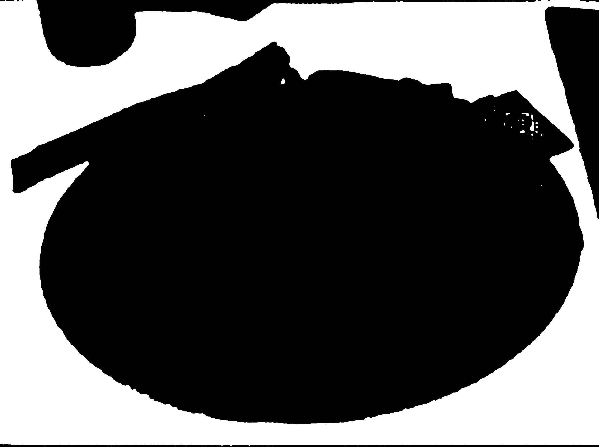
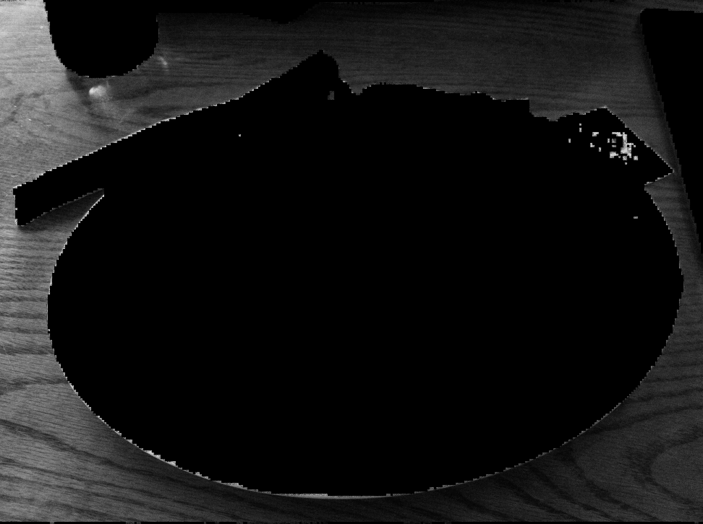
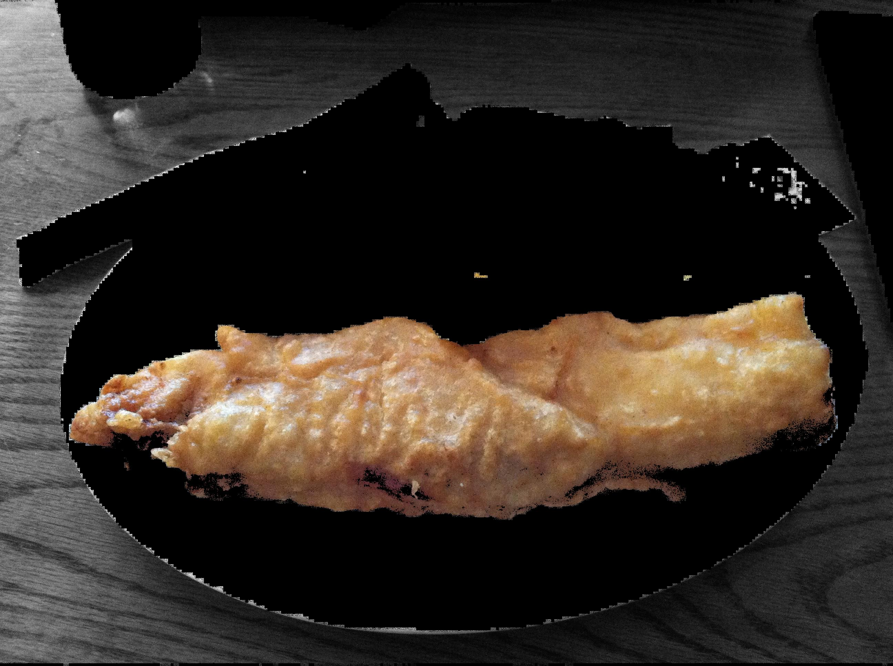

# Classify then Annotate Food Only

## Segmentation using SAM 

### Segment Anything Model

Meta AI has released the Segment Anything Model (SAM), a new open source AI model that can segment any object in an image or video with a single click.
The image 

Original image             |  Segmented image
:-------------------------:|:-------------------------:
  |  

## Classification using CLIP

### Contrastive Language-Image Pre-Training

OpenAI has released the Contrastive Language-Image Pre-Training (CLIP) that is an open source, multi-modal, zero-shot model. Given an image and text descriptions, the model can predict the most relevant text description for that image, without optimizing for a particular task.

### Mask in Computer Vision

A mask is a binary image consisting of zero and non-zero values.
Typically, each pixel is assigned a number between 0 and 255, where 0 represents the complete absence of light (black) and 255 represents complete saturation of light (white).

The image on the left is the mask of the table. The other image shows table without masking and applying grayscale color.

Masked table             |  Unmasked table (gray)
:-------------------------:|:-------------------------:
  |  

The image below is the mask of the fish fried.

Masked fried fish             |  Unmasked fried fish
:-------------------------:|:-------------------------:
  |  

## Annotation/Merge

### Logistic of Image Merge

In general, simply put, we iterate through a list of masks, then unmask it, then convert it to grayscale image if the unmasked object is not a food.
Otherwise, if the unmasked object is identified as a food, then the code applies BGR color to the object.

Unmasked table (grayscale)             |  Merged image
:-------------------------:|:-------------------------:
  | 

## Challenge

1. Small data pool -- The `Food101` model has only 101 classes. It's not enough to identify.
1. Accuracy of classification -- The segmented image itself is often identified differently. The unmasked fried fish is identified as 'fried chicken'. But the original image including the fried fish is identified as a 'fish and chips'. 