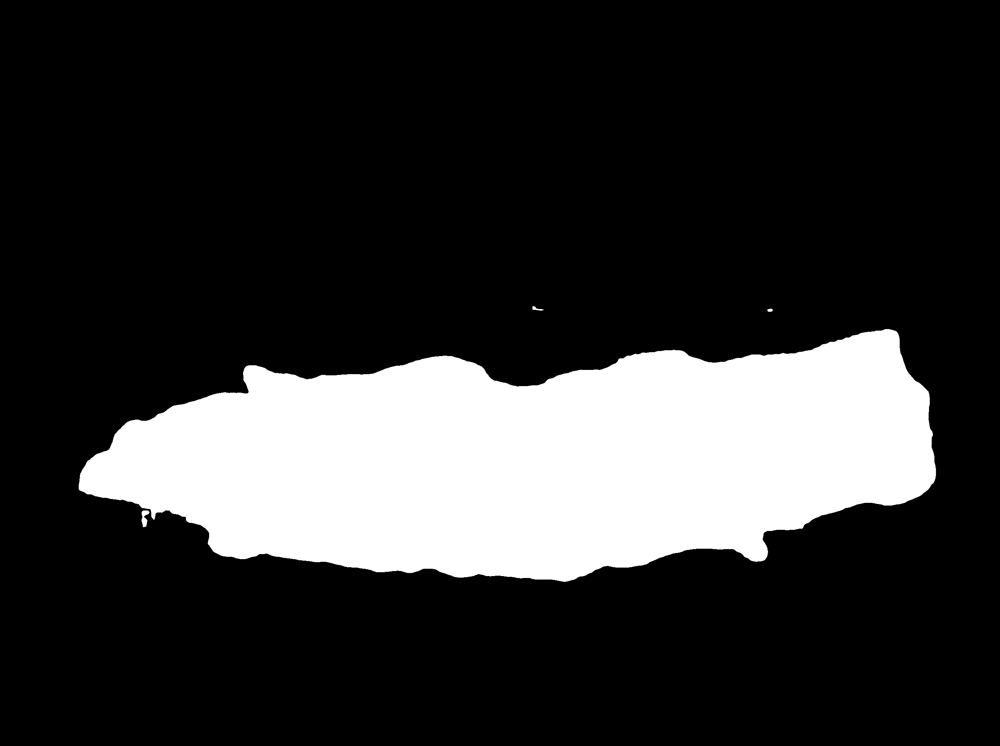
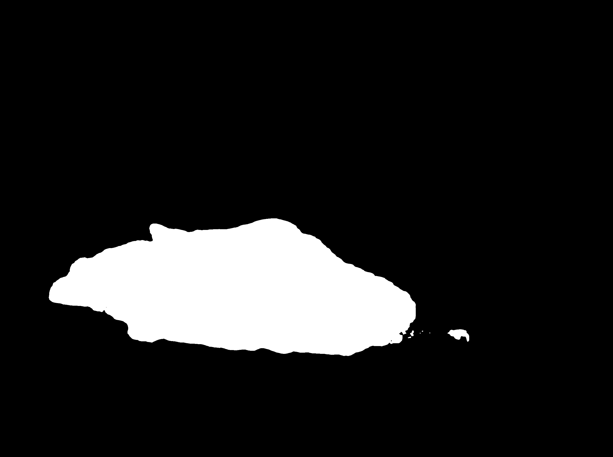
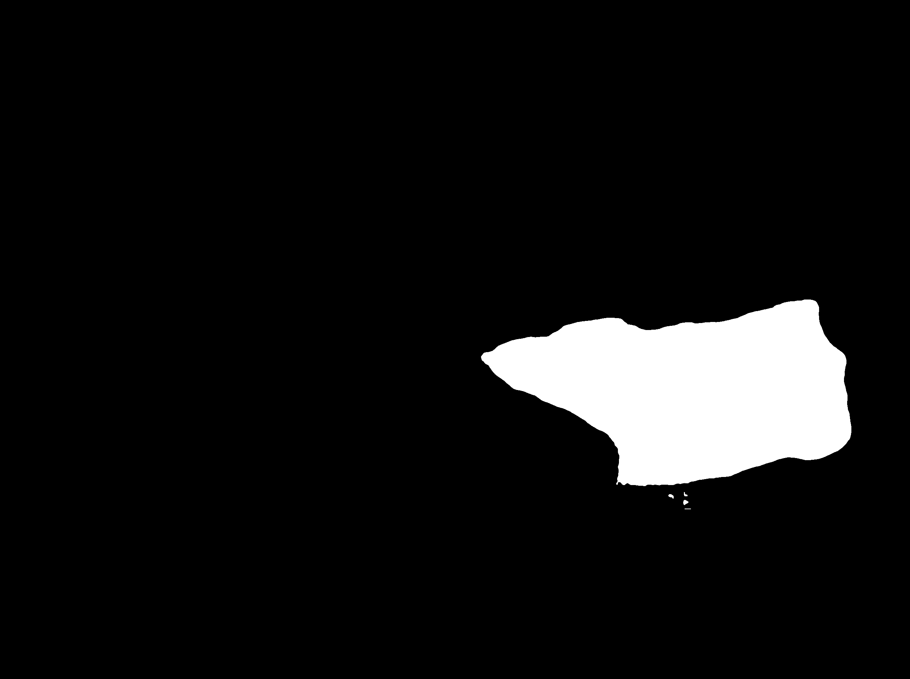
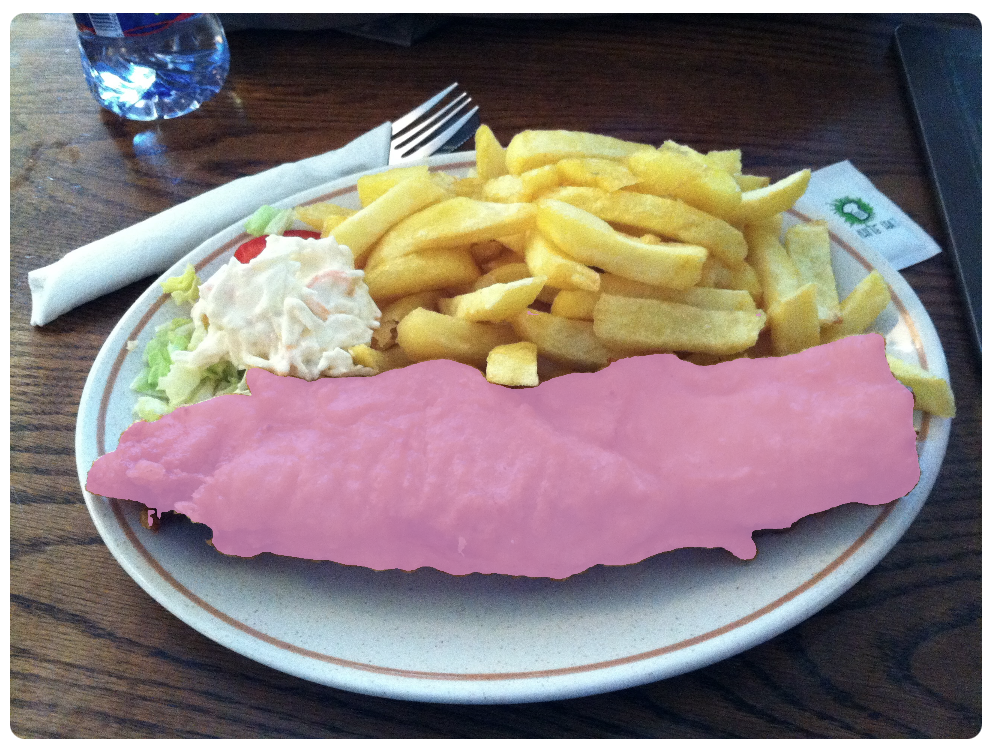
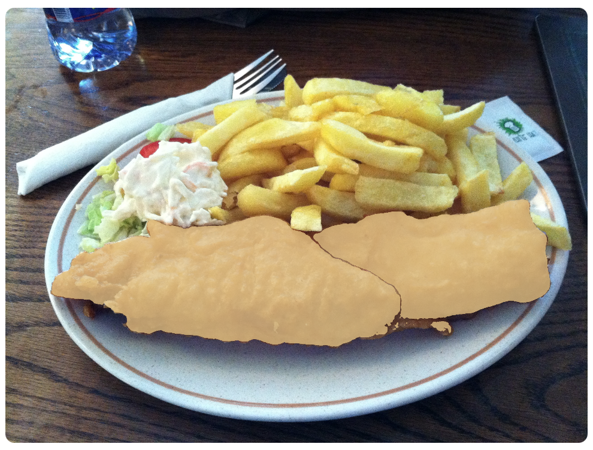
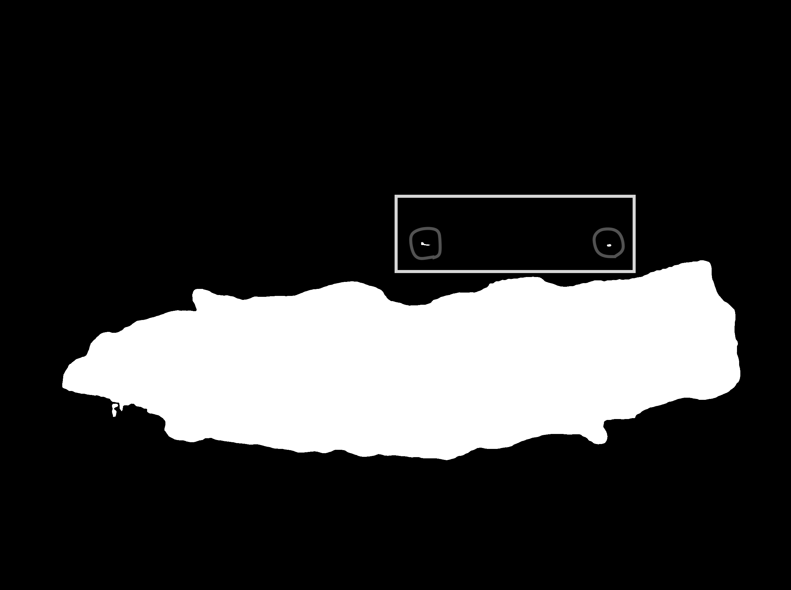

# Report of the Week: July 30 - Aug 5, 2023

## Unpredictable Segmentation

### A pixel co-owned by masks

An image is translated into a matrix and each entry in a matrix is called pixel and it holds a color value. In my `DietVision` class [(here)]('../../../../app/diet_vision.py'), I have a method that maps a pixel `(m, n)` to mask index (indices). For example, if a pixel at (x, y) = (1784, 700) does belong to `Mask 1`, it can be described as `diet_vision_dictionary[1]['nonzero_at'] = {(1784, 700), ...}`. `diet_vision_dictionary[1]['nonzero_at']` stores a list of pixels that belong to `Mask 1`. Here's a schema of the variable `diet_vision_dictionary`.

```python
diet_vision_dictionary: list(dict) = [{
    [mask_index]: {
        'mask': numpy.ndarray,  # binary mask and reverse order by area (bigger comes first)
        'area': int,            # a number of pixels
        'class': str,           # food class
        'nonzero_at': set       # index set of white pixels
    }
}]
```

Let's take a look at masks below. It's not true that every pixel in `Mask 3` does belong to `Mask 1` (*Fig.1.1* and *Fig.1.2*). However, it's true that a large portion of pixels in `Mask 3` does belong to `Mask 1` (*Fig.1.1* and *Fig.1.2*). Not every pixel in the image belongs to one mask. A pixel can appear on any masks. Most importantly, this co-owned pixels happen every image that I tested.

`Mask 1`             |  `Mask 3`              | `Mask 4`
:-------------------------:|:--------------------------:|:-------------------------:
  |   | 
*Fig.1.1*                  | *Fig.1.2*                  | *Fig.1.3*

### Symptoms

Because of the reason explained above, if masks are sharing a large number of pixels with each other, it interferes with an object selection. For example, when a user clicks the left half of the fried chicken (*Fig.1.1* and *Fig.1.2*), then `Mask 1` and `Mask 2` are selected and annotated as shown in *Fig.2.1*. In this picture, `Mask 1` overlaps `Mask 2`. This is the reason why the result looks like only single object is annotated. Then here comes an issue. When a user clicks the right half of the fried chicken (*Fig.1.3*), then `Mask 3` is selected and annotated because `Mask 3` as shown in *Fig.1.3*, it takes up the right half of the fried chicken. At the same time, since `Mask 1` has already been selected, the second click leads it to unselect `Mask 1` and the outcome is as shown below *Fig.2.2*. 

Select `Mask 1`              |  Unselect `Mask 1`
:-------------------------:|:--------------------------:
|
*Fig.2.1*                  | *Fig.2.2*

### Side Issue -- Mask Island

`Mask 1` with two islands
:-------------------------:

*Fig.3.1*                  

There are two islands (circled in *Fig.3.1*). If a user select the region shown in the *Fig.3.1* (rectangle), since the two mask islands (circled in *Fig.3.1*) belong to `Mask 1` although these are separate from the main area, the backend understands that an user tries to select objects in the rectangle region along with the `Mask 1`. This makes segmentation group selection unpredictable until we look into every mask.

### Another Option - A winner takes it all

In this context, a winner refers to a mask with larger area. To fix the issue explained above, I designed another data structure that maps a pixel (m, n) to a mask index.

```python
mask_dictionary: numpy.ndarray = [
    [..., a, ...], 
    [b, ..., ...],
    ...,
    [..., ..., c]
]
```

If a pixel `(m, n)` is shared with `Mask 1` and `Mask 2`, then mapping logic from pixel point to mask index picks one with the larger mask area. If we end up with `mask_dictionary[m][n] = 1`, it indicates that `area(Mask 1) > area(Mask 2)`. In this specific "Fried Chips" case, this `A winner takes it all` workaround works. However, this still has much to improve. The segmentation accuracy drops when `Mask X` is entirely a part of `Mask Y`. It means that a user won't ever be able to touch `Mask X`, but instead, `Mask Y` will always be annotated. 

## Conclusion

Should we conclude that Meta's SAM is not good enough for DietVision? I don't think so. A number of factors are taken into consideration for a mask generator. It should consider a color diffusion and a shade of an object. In my opinion, to improve the accuracy of the segment group selection, we should consider developing a solid classification model. That way, we can do reduce and combine a similar kind of masks. Here's a logic.

```text
- Segments an input image. This produces a list of masks.
- Run a classification and apply it to every mask to predict an object in it.
- If there are masks that can put into the same category, merge these masks
```
