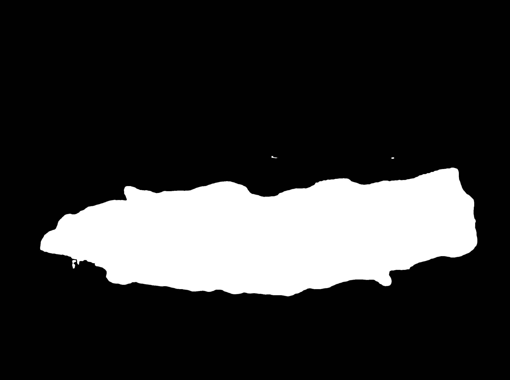
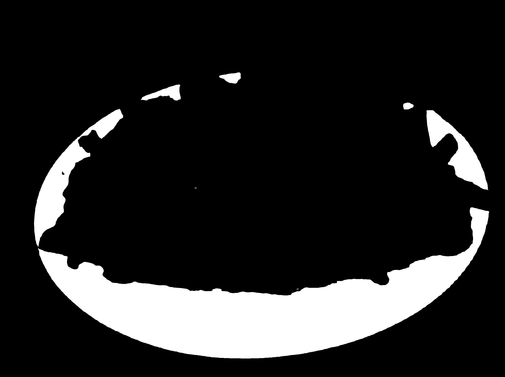
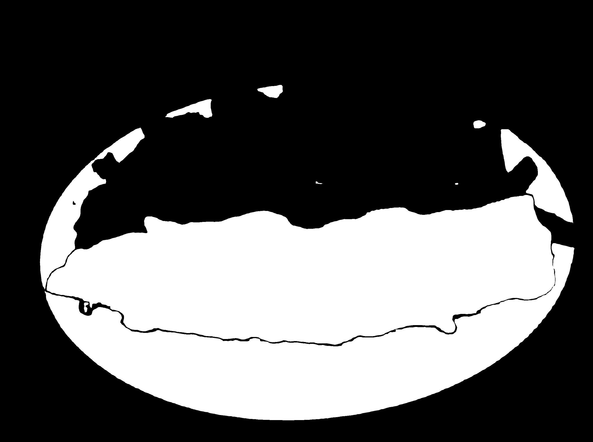

# Report of the Week: June 25 - July 1, 2023

## Recap

- Explore the UI frameworks to present the DietVision demo
- Gray out a non-food segmentation and fill with an RGB color for a food segmentation
- A segmented object should be clickable and provides an user with its food class along with the area. But the class can be modified by user if it's incorrect.

## Study

### UI Option

1. Gradio: Great for a machine learning app presentation (easy to publish and offer an user friendly UI)
2. FastAPI: Fast and high performance web framework and one of the most famous options

### Masks and OpenCV's `bitwise` 

A mask is a binary image consisting of zero and non-zero values. Typically, each pixel is assigned a number between 0 and 255, where 0 represents the complete absence of light (black) and 255 represents complete saturation of light (white).

An image is an array, or a matrix, of square pixels (picture elements) arranged in columns and rows. OpenCV provides a real-time optimized Computer Vision library, tools, and hardware. A mask merge can be simply done using OpenCV's `bitwise_{operation}` functions. 

Assume that we have two identical-sized masks (`n` x `n`) `M1` and `M2`. For any `s` and `t` (0 <= `s`, `t` < `n`), the following holds true.

| `M1[s,t]` | `M2[s,t]` | `bitwise_and` | `bitwise_or` | `bitwise_xor` |
|---------|---------|-------------|------------|-------------|
| 1       | 1       | 1           | 1          | 0           |
| 1       | 0       | 0           | 1          | 1           |
| 0       | 1       | 0           | 1          | 1           |
| 0       | 0       | 0           | 0          | 0           |

Note that 1 represents `white` color and 0 represents `black` in the merged mask.

For example, the image below is obtained by merging two masks using `bitwise_or` because `or` operator indicates including both sides while `and` only counts as a `1` only if `M1[s,t]` = `M2[s,t]` = 1 

Mask 1                     |  Mask 2                   | Merged Mask              
:-------------------------:|:-------------------------:|:-------------------------:
  |   | 

All my progress code can be found [here](https://colab.research.google.com/drive/1DDLwdMnWF8Wqlwv2gXmZV2Bd4vqpvNuU?usp=sharing)

### Discussion

1. Food-475: Realized that 101 classes of food are not enough to predict any random food. Found that there could possibly be a model that offers more than 475 classes. This would increase accuracy in prediction.
2. Image Clickable: SAM segments any object shown in the image. I haven't came to conclusion if we can make a segmented object clickable using SAM. 
3. HelloPhotogrammetry: Requires a bulk number of images to compute the volume. Improvement is needed. 
4. Pick one UI option where the DietVision application is running on.

### Next Week
